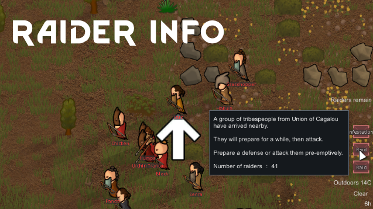

# RaiderInfo

## Features

- 襲撃時のレターの説明に襲撃人数を表示
- 敵対派閥がマップ内にいる時、「敵対勢力がいる」のアラートを表示
  - オンカーソルで、各敵対派閥の残り人数を表示
  - クリックで、敵対している生物にカメラを移動

### Changes from Original

- (Optional) Anomalyのプレイヤーから見えない敵を、デフォルトで警告しないように。
  - 人数にも含まれなくなります。
  - 全員見えない場合はアラートが表示されません。
- (Optional) 未知のエリアにいる敵を含めるオプションを追加
  - デフォルトでは含めません（オリジナルと同様）
- その他、表記に関する軽微なバグ修正

## Languages

| Language           | Contributor     |
| ------------------ | --------------- |
| English            | -               |
| Japanese           | -               |
| ChineseSimplified  | kerong1314      |
| ChineseTraditional | kerong1314      |
| German             | Quadrum         |
| Polish             | 乞食Strzig??    |
| Korean             | Orange Mushroom |
| Russian            | MORTY MORT      |
| Spanish            | Pollo frito     |
| Swedish            | JaY             |
| Thai               | temporarize     |

If you show me the link of translation file, I will add language file to mod.

## License

- [CC BY-NC-SA](https://creativecommons.org/licenses/by-nc-sa/4.0/)
- [MIT License — Copyright 2017 TammyBee](LICENSE)

> This is an updated version of an existing mod, and I don't claim ownership of it.
> I'll remove it if the original author requests.
>
> Original:
> [RaiderInfo[1.0-1.4]](https://steamcommunity.com/sharedfiles/filedetails/?id=1537869190)
